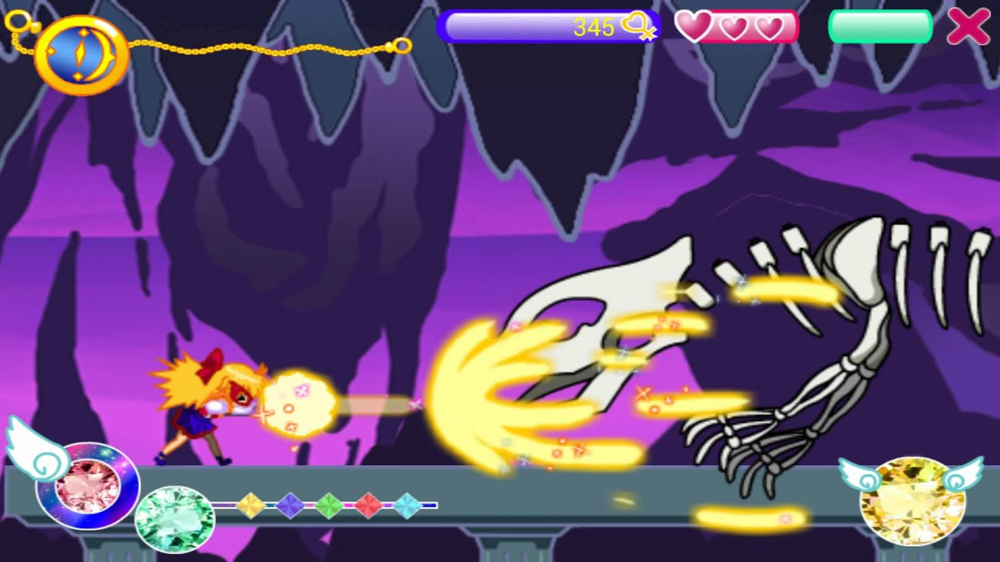
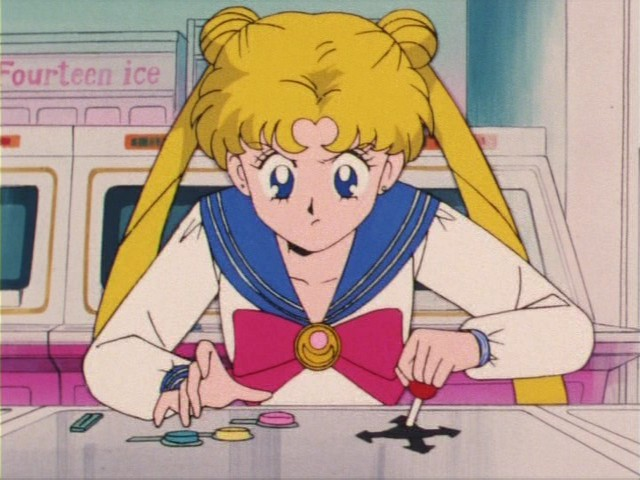
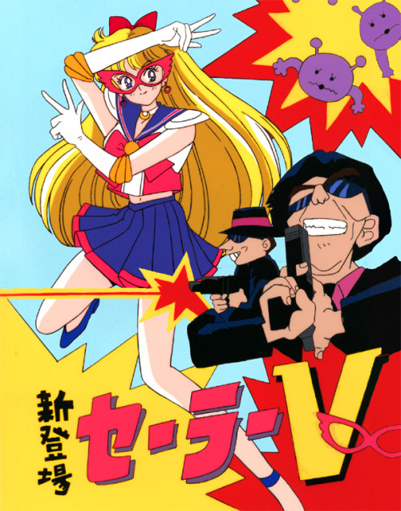
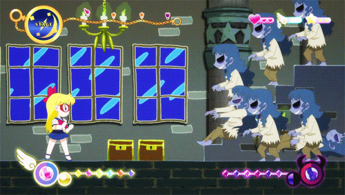
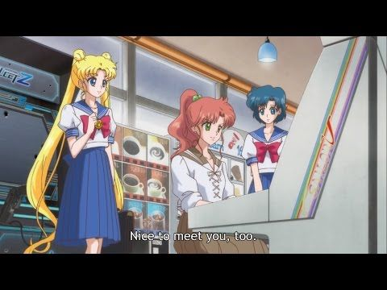
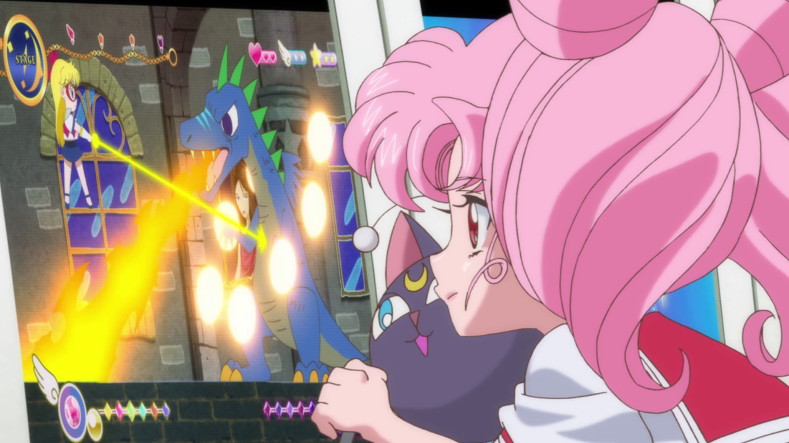
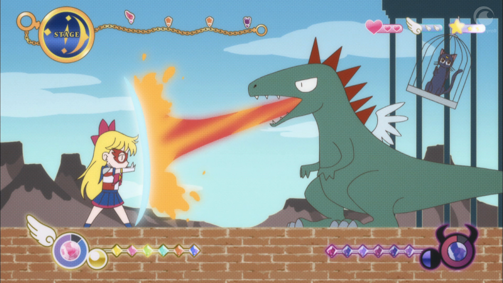

### Shmup Remix Template

- This is the beginning shmup game template for Game Development at CU Boulder ATLAS Fall 2019 with Matt Bethancourt
- This repository will be tweaked and edited over time to create a shmup game that is intended for learning and creative purposes

### Sailor V Shmup Game
This would be a Sailor Moon Game that I always wanted to have exist. In the story of Sailor Moon (manga to anime) there is a Sailor V 2D Plat-former game that also has an element of shmups to it. There have been many attempted versions of Sailor Moon games in the past, but none of them really attempted to recreate or make a better version of this Sailor V Game. I am currently unable to find a clip on youtube, but I can find many episodes that show this game. Even as early as episode 1!! And a few years ago, there was a Sailor V made fan game for android:

https://apkpure.com/silver-crystal-for-sailor-v/com.gmail.imagination.duo.Sailor_V

But it was fan made and thus never official, never complete, had quite a few bugs, and was quickly shut down. This is something I would really love to make for myself, my friends, the fans and if possible as official merchandise for Sailor Moon.

I dont want to make a copy of the Sailor V android game, instead, I really want to start from scratch and make it my own and as close to the original game in the manga as possible. I managed to find more images of what I mean, as to be more clear, however I still haven’t found a good clip of the Sailor Scouts playing the game.

The player interaction pattern would be single pattern for now, where the player is able to control Sailor V. Sailor V can jump and shoot lasers and move backwards and forwards in the game. There are many enemies to defeat using your laser beams. She can defend and deflect but will need to collect items/magic to do so. As the game progresses, her power and abilities will also get stronger to match the difficulty of the levels and the game. The game will not require that the player have x amount of power ups or extra health in order to win though - the game should be beatable even if a player never gets extra power ups and lives that aren’t explicitly given to them. She can of course take damage and if we don’t find items to heal, thus, the player will have to think more carefully to try and keep her alive and fighting. 

Sailor V and the player's current objective in the game is to save Luna the cat from the dragon like it is shown in Sailor Moon Crystal. After rescuing Luna, I would like to expand the players objectives to include saving her friends and the world from the evils of the Negaverse.  Ideally, the final outcome would be the player having rescued her cats, friends, and has defeated the main boss of the Negaverse. Thus the world is saved and the player can applaud themselves for a job well done. 

Puzzles I think would be more similar to Mario 2D platformer style puzzles as all the art and concepts I have seen for the Sailor V Game are also 2D Platformer. Unlike Mario, though, Sailor V can also shoot laser beams as her main ability. I am not sure if I should make this an infinite supply like most SHMUP games I know, or if I should add a stamina/energy bar to force the player to be more mindful with there.

##### RESOURCES
- Health : Collecting hearts to keep Sailor V alive and going
- Items  :  Collecting rainbow crystals so that she can have a magic defense shield that lasts 2-3 times. This way the player can’t use the defense the whole game/level. They need to be strategic about when the shield really need to be used.
- Money : Collecting stars would allow the player to get more power ups, buy more health, as the game progresses to help them beat more minions and have time to think through a puzzle without too much worry about incoming enemies while they do so. 

## IMAGES/INSPIRATION/INFO
### The Android Game

###### The Android Sailor V Game - Fan Made

### Sailor Moon Anime : Original
###### Usagi plays Sailor V with passion

###### The Sailor V Game Poster in front of the Arcade

### Sailor Moon Crystal Anime : New
###### Animated Gif of Sailor V game from Sailor Moon Crystal

###### Usagi, Lita and Ami playing Sailor V

###### Chibi-Usa playing Sailor V, attempting to hack into the headquarters

###### Usagi dreams of the Sailor V game

